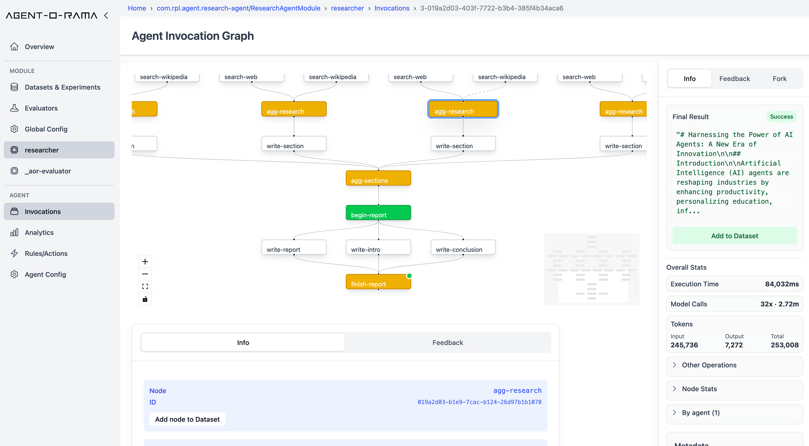
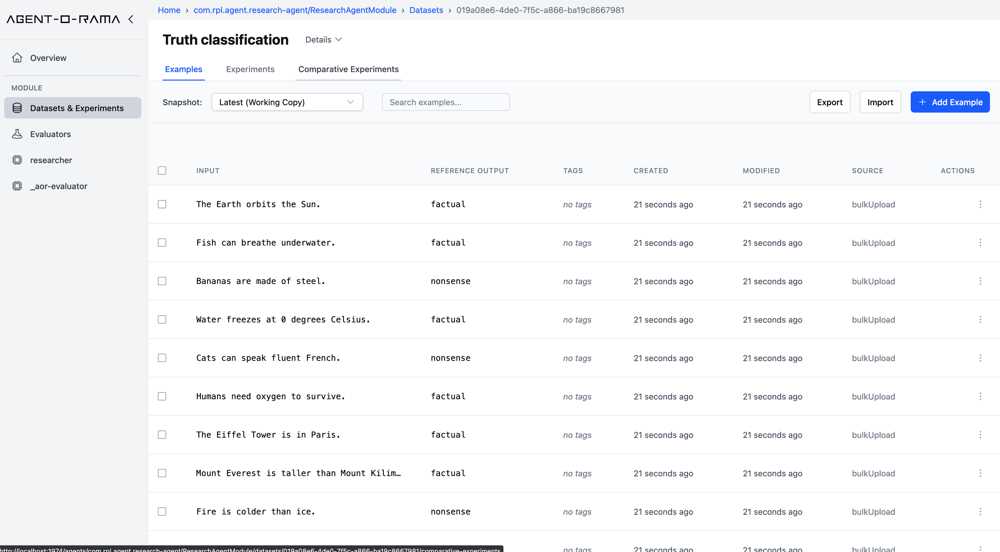
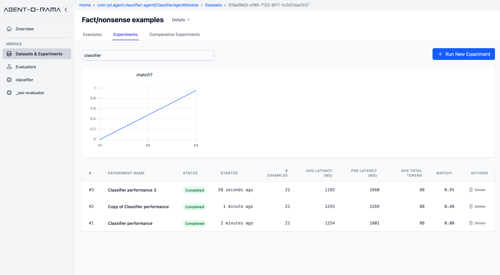
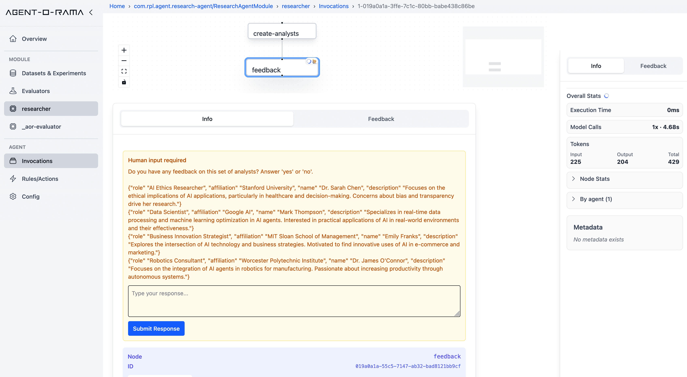
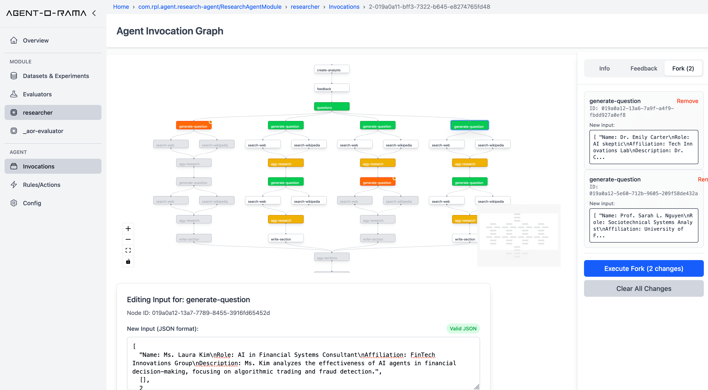
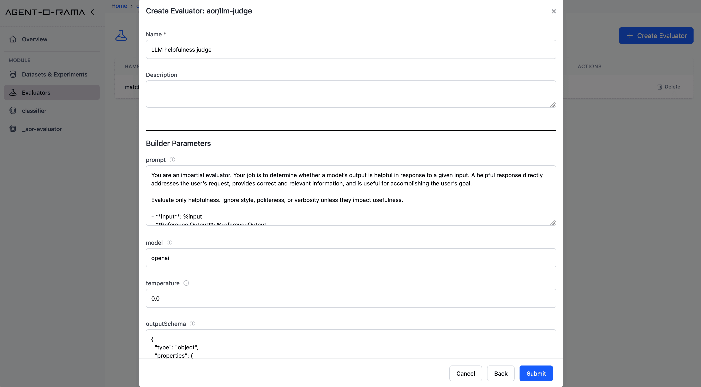
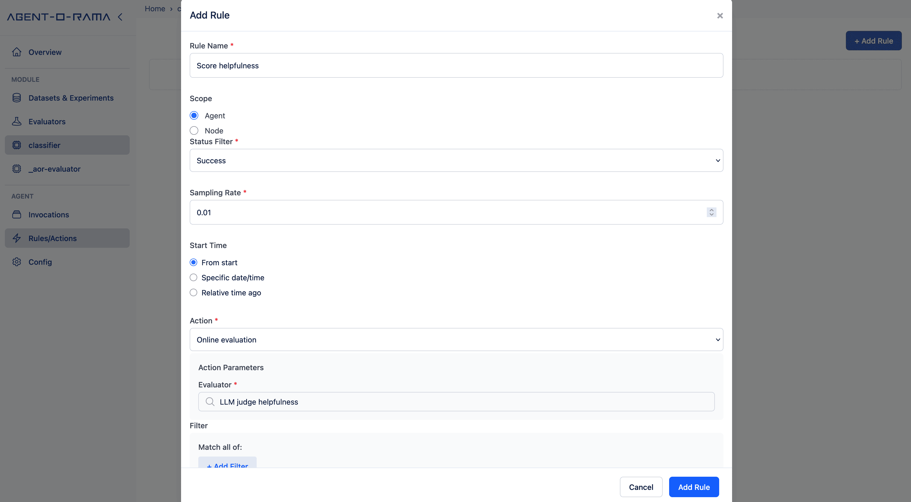

# Agent-o-rama

Agent-o-rama is a library for building scalable and stateful AI agents in Java or Clojure. Agents are defined as simple graphs of pure Java or Clojure functions, and Agent-o-rama automatically captures detailed traces and provides facilities and a web UI for offline experimentation, online evaluation, time-series telemetry (e.g. latencies, token usage), and much more. Agent-o-rama is heavily inspired by [LangGraph](https://www.langchain.com/langgraph) and [LangSmith](https://www.langchain.com/langsmith/observability).


<p align="center">
  
  
  
</p>
<p align="center">
  
  
  
</p>

TODO: add telemetry image here

- [Key similarities and differences with LangGraph/LangSmith](#-key-similarities-with-langgraphlangsmith)
- [Downloads](#downloads)
- [Learning Agent-o-rama](#learning-agent-o-rama)
- [Tour of Agent-o-rama](#tour-of-agent-o-rama)
  - [Defining and Deploying Agents](#defining-and-deploying-agents)
  - [Viewing Agent Traces](#viewing-agent-traces)
  - [Forking Agent Invokes](#forking-agent-invokes)
  - [Incorporating Human Input into Agent Execution](#incorporating-human-input-into-agent-execution)
  - [Streaming Agent Nodes to Clients](#streaming-agent-nodes-to-clients)
  - [Creating and Managing Datasets](#creating-and-managing-datasets)
  - [Running Experiments](#running-experiments)
  - [Online Actions](#online-actions)
  - [Time-series Telemetry](#time-series-telemetry)


LLMs are powerful but inherently unpredictable, so building applications with LLMs that are helpful and performant with minimal hallucination requires being rigorous about testing and monitoring. Agent-o-rama addresses this by making evaluation and observability a first-class part of the development process, not an afterthought.

Agent-o-rama is deployed onto your own infrastructure on a [Rama cluster](https://redplanetlabs.com/), which is free to use. Every part of Agent-o-rama is built-in and requires no other dependency besides Rama, including high-performance, durable, and replicated storage of any data model that can be used as part of agents. Agent-o-rama also integrates seamlessly with any other tool, such as databases, vector stores, external APIs, or anything else.

Agent-o-rama integrates with [Langchain4j](https://docs.langchain4j.dev/) to automatically capture traces for any model calls or embedding store operations used and automatically stream model calls to clients. If you'd prefer to use different APIs to interact with models, that's fine as using Langchain4j with Agent-o-rama is optional.

Rama can be downloaded [here](https://redplanetlabs.com/download), and instructions for setting up a cluster are [here](https://redplanetlabs.com/docs/~/operating-rama.html#_setting_up_a_rama_cluster). A cluster can be [as small as one node](https://redplanetlabs.com/docs/~/operating-rama.html#_running_single_node_cluster) or as big as thousands of nodes. There's also one-click deploys [for AWS](https://github.com/redplanetlabs/rama-aws-deploy) and [for Azure](https://github.com/redplanetlabs/rama-azure-deploy). Instructions for developing with and deploying Agent-o-rama [are below](#downloads).

Development of Agent-o-rama applications is done with "in-process cluster" (IPC), which simulates Rama clusters in a single process. IPC is great for unit testing or experimentation at a REPL. [See below](#defining-agents) for examples in both Java and Clojure of agents utilizing an LLM run with IPC.

The following are the key similarities and differences between Agent-o-rama and LangGraph/LangSmith:

### ✅ Key Similarities with LangGraph/LangSmith

#### 🧱 Agent Structure

- **Graph-based agent definitions:**  
  Agents are defined as explicit graphs of regular Java or Clojure functions, with named nodes and edges, similar in spirit to LangGraph's approach to structured agent workflows.

- **Forking and versioning:**  
  Any agent or node can be forked and modified independently, useful for testing prompt or logic variations without disrupting production agents.

#### 📋 Execution & Tracing

- **Structured execution traces:**  
  Every agent invocation is captured as a trace with detailed stats on every aspect of execution including latency, token usage, model calls, tool invocations, and database calls.

- **Streaming at the node level:**  
  Nodes can emit intermediate chunks before completing, allowing fine-grained, real-time streaming. LLM calls are automatically streamed, and the AOR API includes methods to explicitly stream chunks from a node. A first-class client API can register a callback to receive all chunks from a node.

#### 🧪 Experimentation & Evaluation

- **Datasets and snapshots:**  
  Inputs and outputs can be captured into versioned datasets, making it easy to replay examples and benchmark changes.

- **Experiments (agent-wide or per-node):**  
  Test entire agents or individual nodes (e.g., a new prompt or model) against datasets. Results are evaluated using any number of user-defined evaluators, whether custom functions or using LLMs to score.

- **Online evaluation and actions:**  
  Actions are user-defined hooks that run on a sampled subset of live agent or node executions. They can be used for real-time evaluation, dataset capture, triggering webhooks, or any custom logic. Actions can filter on conditions like latency, token usage, errors, or input/output content.

#### 🤝 Interaction & Monitoring

- **Human input integration:**  
  Agents can pause mid-execution to request structured human input, then resume once the input is received.

- **Telemetry:**  
  Detailed, real-time time-series metrics across all agents, including invocation rates, latencies, model and token usage, database access, custom evaluator metrics, and more.

---

### 🔀 Key Differences with LangGraph/LangSmith

#### 💻 Language & Runtime

- **JVM, not Python:**  
  AOR is a platform for developing agents on the JVM in Java or Clojure.

- **Distributed, parallel execution model:**  
  AOR agents are distributed, parallel execution graphs with no central state or coordinator. Each node runs independently, and emit targets are processed concurrently across threads and machines.

- **Agent code executes on virtual threads:**
  All agent code executes on [virtual threads](https://docs.oracle.com/en/java/javase/21/core/virtual-threads.html), which lets all code be written in a blocking style without consuming scarce platform threads. Coding long-running or I/O-intensive tasks is straightforward since the complexity of callbacks or async frameworks is avoided.

- **Feature parity:**  
  Agent-o-rama doesn't have every feature of Langsmith yet, such as annotation queues and "few-shot examples". However, we're working on those.

#### 🧠 State & Control

- **Built-in, high-performance storage:**  
  Built-in, high-performance storage (document stores, KV stores, or any other data model) eliminates the need for external databases in most cases. This greatly simplifies deployment, optimization, and operations.

- **First-class human input:**  
  Human input is a first-class API rather than based on using exceptions for break points.

#### ☁️ Deployment

- **Unified infrastructure:**  
  Everything is deployed onto your own infrastructure via [Rama](https://redplanetlabs.com/), and there are no hosted services. The full system runs locally, in the cloud, or across clusters with no dependency on external SaaS platforms.

## Downloads

Download Agent-o-rama releases [here](https://github.com/redplanetlabs/agent-o-rama/releases). A release is used to run the Agent-o-rama frontend. See [this section](https://github.com/redplanetlabs/agent-o-rama/wiki/Quickstart#running-on-a-local-rama-cluster) for instructions on deploying. For building agent modules, add these repositories to the Maven dependencies for your project:

```
<repositories>
  <repository>
    <id>nexus-releases</id>
    <url>https://nexus.redplanetlabs.com/repository/maven-public-releases</url>
  </repository>
  <repository>
    <id>clojars</id>
    <url>https://repo.clojars.org/</url>
  </repository>
</repositories>
```

The Maven target for Agent-o-rama is:

```
<dependency>
  <groupId>com.rpl</groupId>
  <artifactId>agent-o-rama</artifactId>
  <version>0.5.0</version>
</dependency>
```

## Learning Agent-o-rama

* [Quickstart](https://github.com/redplanetlabs/agent-o-rama/wiki/Quickstart)
* [Full documentation](https://github.com/redplanetlabs/agent-o-rama/wiki)
* [Javadoc](TODO)
* [Clojuredoc](TODO)
* [Mailing list](https://groups.google.com/u/1/g/rama-user)
* #rama channel on [Clojurians](https://clojurians.slack.com/)


## Tour of Agent-o-rama

Below is a quick tour of all aspects of Agent-o-rama, starting with defining agents through running experiments and analyzing telemetry.

### Defining and deploying agents

Agents are defined in "modules" which also contain storage definitions, agent objects (such as LLM or database clients), custom [evaluators](TODO), and custom [actions](TODO). A module can have any number of agents in it, and a module is launched on a cluster with one-line commands with the Rama CLI. For example, here's how to define a module `BasicAgentModule` with one agent that does a single LLM call and run it in the "in-process cluster" (IPC) development environment in both Java and Clojure:

#### Java example

```java
public BasicAgentModule extends AgentModule {
  @Override
  protected void defineAgents(AgentTopology topology) {
    topology.declareAgentObject("openai-api-key", System.getenv("OPENAI_API_KEY"));
    topology.declareAgentObjectBuilder(
      "openai-model",
      setup -> {
        String apiKey = setup.getAgentObject("openai-api-key");
        return OpenAiStreamingChatModel.builder()
            .apiKey(apiKey)
            .modelName("gpt-4o-mini")
            .build();
      });
    topology.newAgent("basic-agent")
            .node("chat",
                  null,
                  (AgentNode node, String prompt) -> {
                    ChatModel model = node.getAgentObject("openai-model");
                    node.result(model.chat(prompt));
                  });
  }
}

try (InProcessCluster ipc = InProcessCluster.create();
     Object ui = UI.start(ipc)) {
  BasicAgentModule module = new BasicAgentModule();
  ipc.launchModule(module, new LaunchConfig(1, 1));
  String moduleName = module.getModuleName();
  AgentManager manager = AgentManager.create(ipc, moduleName);
  AgentClient agent = manager.getAgentClient("basic-agent");

  String result = agent.invoke("What are use cases for AI agents?");
  System.out.println("Result: " + result);
}
```

#### Clojure example

```clojure
(aor/defagentmodule BasicAgentModule
  [topology]
  (aor/declare-agent-object topology "openai-api-key" (System/getenv "OPENAI_API_KEY"))
  (aor/declare-agent-object-builder
   topology
   "openai-model"
   (fn [setup]
     (-> (OpenAiStreamingChatModel/builder)
         (.apiKey (aor/get-agent-object setup "openai-api-key"))
         (.modelName "gpt-4o-mini")
         .build)))
  (-> topology
      (aor/new-agent "basic-agent")
      (aor/node
       "start"
       nil
       (fn [agent-node prompt]
         (let [openai (aor/get-agent-object agent-node "openai-model")]
           (aor/result! agent-node (lc4j/basic-chat openai prompt))
         )))))

(with-open [ipc (rtest/create-ipc)
            ui (aor/start-ui ipc)]
  (rtest/launch-module! ipc BasicAgentModule {:tasks 4 :threads 2})
  (let [module-name (rama/get-module-name BasicAgentModule)
        agent-manager (aor/agent-manager ipc module-name)
        agent (aor/agent-client agent-manager "basic-agent")]
    (println "Result:" (aor/agent-invoke agent "What are use cases for AI agents?"))
    ))
```

These examples also launch the Agent-o-rama UI locally at `http://localhost:1974`.

See [this page](https://github.com/redplanetlabs/agent-o-rama/wiki/Programming-agents) for all the details of coding agents, including having multiple nodes, getting human input as part of execution, and aggregation. For lots of examples of agents in either Java or Clojure, see the [examples](https://github.com/redplanetlabs/agent-o-rama/tree/master/examples) directory in the repository.

#### Managing modules on a real cluster

Modules are launched, updated, and scaled on a real cluster with the Rama CLI. Here's an example of launching:

```
rama deploy --action launch \
--jar my-application-1.0.0.jar \
--module com.mycompany.BasicAgentModule \
--tasks 32 \
--threads 8 \
--workers 4 \
--replicationFactor 2
```

The launch parameters are detailed more in [this section](https://redplanetlabs.com/docs/~/operating-rama.html#_launching_modules) of the Rama docs.

Updating a module to change agent definitions, add/remove storage definitions, or any other change looks like:

```
rama deploy \
  --action update \
  --jar my-application-1.0.1.jar \
  --module com.mycompany.BasicAgentModule
```

Finally, scaling a module to add or remove resources looks like:

```
rama scaleExecutors \
--module com.mycompany.BasicAgentModule \
--threads 16 \
--workers 8
```

### Viewing agent traces

A trace of every agent invoke is viewable in the Agent-o-rama web UI. Every aspect of execution is captured, including node emits, node timings, model calls, token counts, database read/write latencies, tool calls, subagent invokes, and much more. On the right is aggregated stats across all node.


### Forking agent invokes

From the trace UI you can also fork any previous agent invoke, changing the arguments for any number of nodes and rerunning from there. This is useful to quickly see how small tweaks change the results to inform further iteration on the agent.


### Incorporating human input into agent execution

Agent-o-rama has a first-class API for dynamically requesting human input in the middle of agent execution. Pending human input is viewable in traces and can be provided there or via the API.


Human input is requested in a node function with the blocking call `agentNode.getHumanInput(prompt)` in Java and `(aor/get-human-input agent-node prompt)` in Clojure. Since nodes run on virtual threads, this is efficient. This returns the string the human provided that can be utilized in the rest of the agent execution.


### Streaming agent nodes to clients

The client API can stream results from individual nodes. Nested model calls are automatically streamed back for the node, and node functions can also use the Agent-o-rama API to explicitly stream chunks as well. Here's what it looks like in Java and Clojure to register a callback to stream a node:

```java
client.stream(invoke, "someNode", (List<String> allChunks, List<String> newChunks, boolean isReset, boolean isComplete) -> {
  System.out.println("Received new chunks: " + newChunks);
};
```

```clojure
(aor/agent-stream client invoke "some-node"
 (fn [all-chunks new-chunks reset? complete?]
   (println "Received new chunks:" new-chunks)))
```

See [this page](https://github.com/redplanetlabs/agent-o-rama/wiki/Streaming) for all the info on streaming.


### Creating and managing datasets

Datasets of examples can be created and managed via the UI or API. Examples can be added manually, imported in bulk via [JSONL](https://jsonlines.org/examples/) files, or added automatically from production runs with [actions](TODO). See all the info about datasets [on this page](TODO).


### Running experiments

Datasets can then be used to run experiments to track agent performance, do regression testing, or test new agents. Experiments can be run on entire agents or on individual nodes of an agent. A single target can be tested at a time, or comparative experiments can be done to evaluate multiple different targets (e.g. the same agent paramterized to use different models).


Experiment results look like:


Experiments use "evaluators" to score performance. Evaluators are functions that return scores, and they can use models or databases during their execution. Agent-o-rama has built-in evaluators like the "LLM as judge" evaluator which uses an LLM with a prompt to produce a score.


See all the info about experiments [on this page](TODO).

### Online actions

Actions can be set up via the UI to run automatically on the results of production runs. Actions can do online evaluation, add to datasets, trigger webhooks, or run any custom function. Actions receive as input the run input/output, run statistics (e.g. latency, token counts), and any errors during the run. Actions can set a sampling rate or filter for runs matching particular parameters.

Online evaluation gets added as feedback on the run that is viewable in traces, and time-series charts are automatically created that are viewable in the [analytics section](#time-series-telemetry). Here's an example of setting up an action to do online evaluation:



Here's an example of creating an action to add slow runs to a dataset:


See [this page](TODO) for the details on creating actions.


### Time-series telemetry

TODO
- split by metadata


TODO
  - clients are just function calls
  - agent objects
  - aggregation
    - should leave this to separate page and get to the rest of the tour
    - multi-aggs
  - tool subagent
    - specifying tools (param schemas, etc.)
    - providing impls
