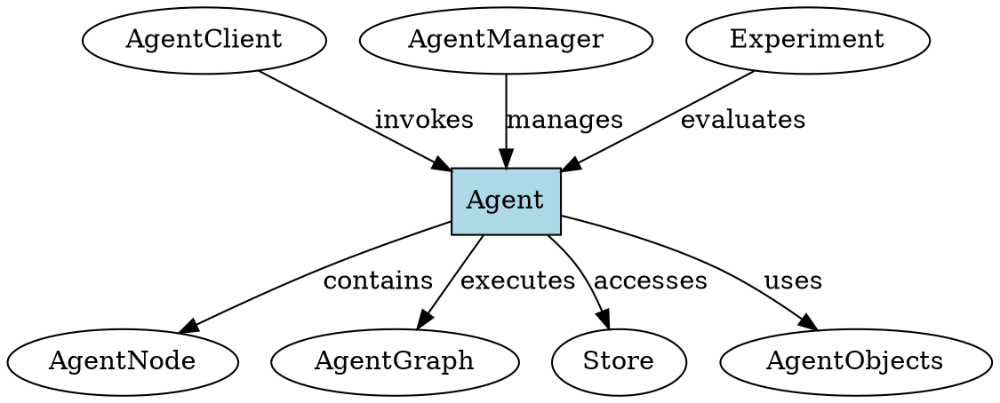

# Agent

## Definition
A distributed, stateful computational unit that executes through a directed graph of interconnected nodes. Agents represent autonomous processing entities that can maintain persistent state, communicate between execution steps, and integrate with external systems.

## Architecture Role
Agents serve as the primary execution entities in the agent-o-rama framework, orchestrating complex workflows across distributed infrastructure. Each agent encapsulates business logic within node functions and coordinates with other agents and external resources through the Rama platform.

## Operations
Agents can be invoked with arguments, forked to create parallel execution branches, and streamed to receive real-time outputs. Agents emit data between nodes, store and retrieve persistent state, and request human input during execution.

## Invariants
Each agent execution maintains a unique identifier throughout its lifecycle. Agents must complete with either a result or failure state. State modifications are isolated per agent execution context.

## Key Clojure API
- Primary functions: `agent-invoke`, `agent-initiate`, `agent-fork`, `agent-result`
- Creation: `new-agent` within `defagentmodule`
- Access: `agent-client` from `agent-manager`

## Key Java API
- Primary functions: `AgentClient.invoke()`, `AgentClient.initiate()`, `AgentClient.fork()`
- Creation: `AgentTopology.newAgent()`
- Access: `AgentManager.getAgentClient()`

## Relationships
- Uses: [agent-node], [agent-graph], [store], [agent-objects]
- Used by: [agent-client], [agent-manager], [experiment]

## Examples
- Clojure: `examples/clj/src/com/rpl/agent/basic/basic_agent.clj`
- Java: `examples/java/basic/src/main/java/com/rpl/agent/basic/BasicAgent.java`