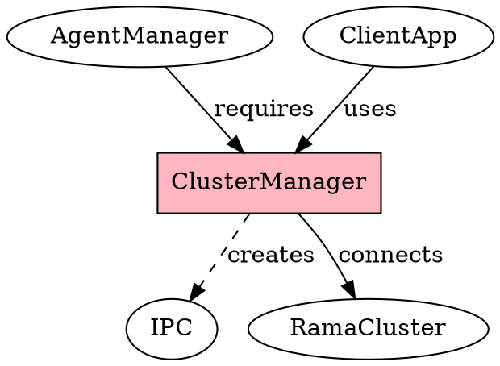

# Cluster Manager

## Definition
An interface for managing and connecting to Rama clusters, providing access to deployed modules and their agents. Cluster managers abstract the details of cluster topology and networking for client applications.

## Architecture Role
Cluster managers serve as the entry point for client applications to interact with distributed Rama infrastructure. They handle cluster discovery, connection management, and provide factory methods for creating agent managers and accessing cluster resources.

## Operations
Cluster managers can connect to remote clusters, validate module deployments, create agent managers for specific modules, and manage connection lifecycles. They handle authentication, load balancing, and failover for cluster communications.

## Invariants
Each cluster manager maintains stable connections to cluster nodes throughout its lifecycle. Cluster managers are thread-safe and can be shared across application threads. Connection state is automatically managed and recovered on failures.

## Key Clojure API
- Primary functions: `rama/remote-cluster`, `agent-manager`
- Creation: Cluster connection functions from Rama
- Access: Used to create agent managers

## Key Java API
- Primary functions: Cluster factory methods from Rama platform
- Creation: Through Rama cluster connection APIs
- Access: Cluster interface implementations

## Relationships
- Uses: Rama platform cluster connectivity
- Used by: [agent-manager], client applications
- Manages: [ipc] (for local development)

## Examples
- Clojure: Development with `rtest/create-ipc` for local clusters
- Java: Production cluster connections through Rama platform APIs