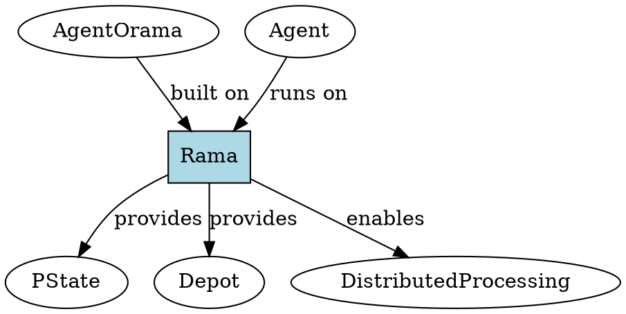

# Rama

## Definition
A distributed computing platform providing stream processing, persistent state management, and horizontal scaling infrastructure. Rama serves as the foundational runtime for agent-o-rama's distributed agent execution.

## Architecture Role
Rama provides the distributed systems infrastructure that enables agents to run across multiple machines with fault tolerance and automatic scaling. It manages data partitioning, replication, and provides the event streaming backbone for agent communication.

## Operations
Rama handles automatic partitioning of data and computation, maintains persistent state through PStates, processes streams of events through depots, and provides query capabilities for distributed data access.

## Invariants
Rama ensures exactly-once processing semantics for all data operations. State mutations are atomic and consistent across the distributed system. All data is automatically replicated and fault-tolerant.

## Key Clojure API
- Primary functions: `module`, `stream-topology`, `microbatch-topology`, `pstate`
- Creation: Module definition macros and topology builders
- Access: Through agent-o-rama abstractions

## Key Java API
- Primary functions: Platform deployment and cluster management APIs
- Creation: Cluster and module management interfaces
- Access: Direct Rama platform APIs (advanced usage)

## Relationships
- Uses: Underlying infrastructure (ZooKeeper, etc.)
- Used by: [agent], [agent-o-rama] framework
- Provides: [pstate], [depot], distributed processing

## Examples
- Clojure: Module definitions in `defagentmodule` macros
- Java: Direct usage through Rama platform APIs for advanced integration