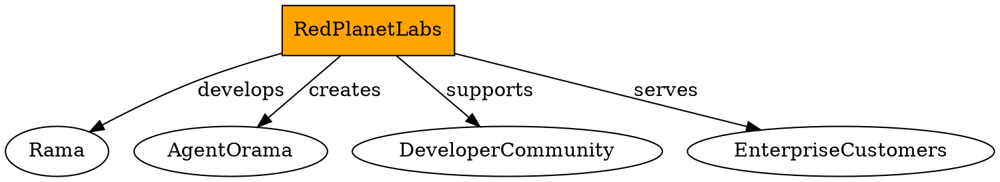

# Red Planet Labs

## Definition
The company that created the Rama distributed computing platform and agent-o-rama framework. Red Planet Labs develops infrastructure for building real-time, scalable distributed applications.

## Architecture Role
Red Planet Labs provides the foundational technology stack that powers agent-o-rama, including the Rama platform for distributed computing and the architectural patterns for building stateful distributed AI systems.

## Operations
Red Planet Labs develops and maintains the Rama platform, provides enterprise support and consulting services, and creates open-source tools for distributed systems development.

## Invariants
Red Planet Labs maintains the Rama platform and its ecosystem. The company provides technical support and development resources for the platform and its applications.

## Key Clojure API
- Primary functions: Not applicable (company entity)
- Creation: Not applicable
- Access: Not applicable

## Key Java API
- Primary functions: Not applicable (company entity)
- Creation: Not applicable
- Access: Not applicable

## Relationships
- Uses: Not applicable
- Used by: Developer community, enterprise customers
- Creates: [rama], [agent-o-rama]

## Examples
- Clojure: Company website and documentation resources
- Java: Enterprise support and consulting services