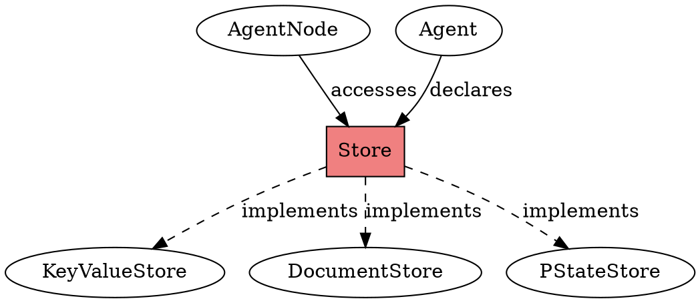

# Store

## Definition
A persistent storage abstraction providing typed access to distributed data within agent execution contexts. Stores encapsulate different storage backends with uniform access patterns for agent state management.

## Architecture Role
Stores provide the persistence layer for agents, enabling stateful computations across distributed infrastructure. They abstract underlying storage mechanisms while ensuring consistency, partitioning, and fault tolerance in distributed agent execution.

## Operations
Stores support get and put operations for key-value access, document field operations for structured data, and PState path operations for complex queries. Operations are automatically partitioned and provide transactional consistency within agent contexts.

## Invariants
Store operations are scoped to agent execution contexts and maintain isolation between concurrent agent invocations. All store modifications are atomic and persistent across failures. Type safety is enforced for declared key-value schemas.

## Key Clojure API
- Primary functions: `store/get`, `store/put!`, `store/update!`, `get-store`
- Creation: `declare-key-value-store`, `declare-document-store`, `declare-pstate-store`
- Access: `get-store` within agent node functions

## Key Java API
- Primary functions: `Store.get()`, `Store.put()`, `AgentNode.getStore()`
- Creation: `AgentTopology.declareKeyValueStore()`, `declareDocumentStore()`
- Access: Through `AgentNode` parameter in node functions

## Relationships
- Uses: [pstate-store], [key-value-store], [document-store]
- Used by: [agent-node], [agent]
- Implements: Persistence for agent state

## Examples
- Clojure: `examples/clj/src/com/rpl/agent/basic/keyvalue_store_agent.clj`
- Java: `examples/java/basic/src/main/java/com/rpl/agent/basic/KeyValueStoreAgent.java`